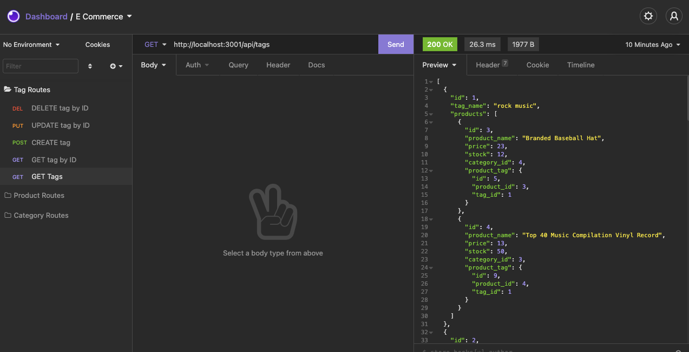

# E-Commerce-Back-End

https://github.com/burnsgirl/E-Commerce-Back-End

https://drive.google.com/file/d/1d-eLcuCKhKCvXipLULuTpI97IdOFuZoR/view?usp=sharing

## Description
This is a back end application for a e-commerce site. This application can be tested with Insomnia and it is run with Express and Sequalize.

## Table of Contents
[Installation](#installation)

[Usage](#usage)

[Technologies Used](#technologies)

[License](#license)

[Contact](#contact)

## Installation
To use this application, you will need to install Express, Sequalize, and MYSQL2. To do so you will need to run npm i in the command line. 
## Usage
In this application you can add products, categories, and tag information for a sales websites. You can use insomnia to do GET, POST, PUT, and DELETE commands to update different information.

## Technologies
Technologies used: JavaScript, SQL, Express, Sequalize

## License
License: None

## Contact
Contact: DAUPHINEBURNS@GMAIL.COM
